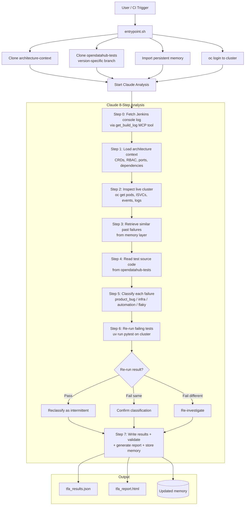

# RHOAI TFA Analyser - Claudio Plugin

A Claude Code plugin that analyzes RHOAI/ODH test failures using component-specific debugger skills, live architecture context, and persistent memory. Accepts any input — ReportPortal launches, log files, directories, URLs, or Jenkins builds.

## Overview

This plugin replaces the standalone TFA CLI with a set of Claude Code skills where **Claude IS the LLM**. Scripts fetch data and enforce workflows; intelligence comes from `SKILL.md` files and Claude's reasoning.

- **Free-form prompts** — describe what you want analyzed in natural language
- **17 skills** — orchestrator + 15 component debuggers + architecture reference
- **Architecture context** — clones latest RHOAI architecture docs from GitHub on every run
- **Test source code review** — clones `opendatahub-tests` and reads the actual test code before classifying
- **Live cluster inspection** — logs into the test cluster via `oc` for pod/event/CRD evidence
- **Persistent memory** — learnings accumulate across runs for better accuracy over time
- **Few-shot learning** — retrieves similar past failures from memory to guide classification
- **Classification rules** — explicit guidance distinguishes infrastructure issues from product bugs and automation bugs
- **Schema validation** — enforces strict classification output format with auto-fix
- **Headroom token compression** — optional `headroom wrap` integration reduces Claude token usage by 60-95%
- **HTML reports** — detailed dark-themed report with severity charts and per-failure cards
- **Live logging** — stream analysis progress via `/tmp/analysis.log`

## Architecture



## Prompt Examples

The prompt is **free-form** — just describe what you want analyzed:

| Prompt | What happens |
|---|---|
| `Analyze launch 10748 Model_server failures and post results to RP` | Fetches failures from ReportPortal, routes to debugger-model-server, posts classifications back |
| `Analyze /workspace/logs/kserve-test.log` | Reads the file, auto-detects kserve component from log content, runs debugger-kserve |
| `Analyze all logs in /var/jenkins/results/` | Scans the directory, analyzes each log file, detects components per file |
| `Analyze https://reportportal.example.com/ui/#ods_ci/launches/all/10748` | Extracts launch ID from URL, fetches from RP |
| `Analyze Jenkins build 542 kserve failures` | Pulls Jenkins build logs via local client, routes to debugger-kserve |
| `Analyze https://myjenkins.redhat.com/job/my_job/542/` | Extracts job path and build number, fetches Jenkins build logs via MCP, and runs analysis |
| `Analyze /tmp/must-gather/logs/ for rhoai_operators issues` | Reads logs from must-gather, routes to debugger-rhoai-operators |
| `Analyze /data/pipeline-run.log for pipelines failures` | Reads the file, routes to debugger-pipelines |

## Skills

### Orchestrator

| Skill | Description |
|---|---|
| `tfa-orchestrator` | Central coordinator — parses prompt, gathers data, routes to debuggers, posts results, stores learnings |
| `architecture-reference` | Provides live RHOAI architecture docs (CRDs, ports, RBAC, dependencies, data flows) from [architecture-context](https://github.com/mwaykole/architecture-context) |

### Component Debuggers

| RP Component | Debugger Skill | Domain |
|---|---|---|
| `Model_server` | `debugger-model-server` | vLLM, TGI, Caikit, S3 model download, GPU/OOM |
| `kserve` | `debugger-model-server/debugger-kserve` | InferenceService, Knative, Serverless, RawDeployment |
| `llmd` | `debugger-model-server/debugger-llmd` | LLMInferenceService, LeaderWorkerSet |
| `modelmesh` | `debugger-model-server/debugger-modelmesh` | Multi-model serving |
| `serving_runtimes` | `debugger-serving-runtimes` | ServingRuntime config |
| `llama_stack` | `debugger-llama-stack` | LlamaStack / OGX operator |
| `Pipelines` | `debugger-pipelines` | DSP v2, Argo workflows |
| `model_registry` | `debugger-model-registry` | Model Registry, MariaDB |
| `workbenches` | `debugger-workbenches` | Jupyter notebooks, PVC |
| `Dashboard` | `debugger-dashboard` | RHOAI Dashboard UI |
| `trustyai` | `debugger-trustyai` | Model explainability |
| `rhoai_operators` | `debugger-rhoai-operators` | DSC/DSCI/Operator lifecycle |
| `Distributed` | `debugger-distributed` | Kueue, CodeFlare, Ray |
| `cluster_health` | `debugger-cluster-health` | Pre-flight cluster checks |
| *(any other)* | `debugger-generic` | Fallback for unrecognized components |

## Project Structure

```
.claude-plugin/
  plugin.json                     # Plugin manifest — registers all 17 skills
skills/
  tfa-orchestrator/               # Central coordinator
    SKILL.md
    scripts/
      fetch_rp_failures.py        # Fetch failures from ReportPortal
      detect_component.py         # Map component name → debugger skill
      post_rp_results.py          # Post classifications back to RP
      validate_results.py         # Schema validation + auto-fix for classification output
      generate_report.py          # HTML report generator (dark-themed dashboard)
      retrieve_examples.py        # Few-shot retrieval — find similar past failures in memory
      store_run.py                # Store run summary + auto-learn each classification
      store_learning.py           # Persist individual learnings to memory
      query_learnings.py          # Query memory for known patterns
      promote_learnings.py        # Promote high-confidence patterns into SKILL.md
      cluster_health.sh           # Read-only cluster health check
  architecture-reference/         # Live RHOAI architecture docs
    SKILL.md
    scripts/
      arch_lookup.py              # Clone/pull architecture-context, query component data
  debugger-model-server/          # Model serving (parent skill + sub-orchestration)
    SKILL.md                      # Sub-orchestrates to kserve/llmd/modelmesh
    scripts/
      inspect_serving.sh          # Model runtime pod inspection
      parse_serving_logs.py
    debugger-kserve/              # InferenceService, Knative, routing
      SKILL.md
      scripts/
    debugger-llmd/                # LLMInferenceService, LeaderWorkerSet
      SKILL.md
      scripts/
    debugger-modelmesh/           # Shared runtimes, model cache, gRPC
      SKILL.md
      scripts/
  debugger-*/                     # 11 other component-specific debugger skills
    SKILL.md                      # Domain knowledge, failure patterns, diagnosis steps
    scripts/
      inspect_*.sh                # Read-only cluster inspection (oc get/describe/logs)
      parse_*_logs.py             # Log pattern extraction
tools/
  common.sh                       # Shared shell helpers
  jenkins-client/                 # Jenkins API client
  rp-client/                      # ReportPortal client
  must-gather/                    # Must-gather parser
memory/
  orchestrator/                   # Cross-component correlations + run history
  components/                     # Per-component learnings
    model-server/                 # Model serving stack learnings
      learnings.json              # Model server (vLLM, TGI, Caikit) learnings
      kserve/learnings.json       # KServe learnings
      llmd/learnings.json         # LLMD learnings
      modelmesh/learnings.json    # ModelMesh learnings
    ...                           # 11 other component dirs
architecture-context/             # Cloned at runtime (gitignored), not committed
Containerfile.claudio             # Container image definition
entrypoint.sh                     # Container entrypoint
```

## Usage

### Local (Claude Code plugin)

```bash
claude plugin install --scope user .
```

Then use any prompt:

```
"Analyze launch 10748 Model_server failures and post results to RP"
"Analyze /workspace/logs/kserve-test.log"
"Analyze all logs in /var/jenkins/results/"
```

### Container Build

```bash
podman build -f Containerfile.claudio -t tfa-claudio:latest .
```

### Container Run

The prompt is the container argument. Mount volumes for log files, outputs, and credentials.

**Outputs:**
- `/tmp/analysis.log` — live analysis log (stream with `tail -f` or mount out)
- `/tmp/tfa_report.html` — detailed HTML report with charts and per-failure cards
- `/tmp/tfa_results.json` — raw classification results as JSON

```bash
# RP launch analysis — mount /tmp/tfa-output to get the HTML report + live log
podman run --rm \
  -e RP_URL=https://reportportal.example.com \
  -e RP_PROJECT=ods_ci \
  -e RP_TOKEN="$RP_TOKEN" \
  -e CLAUDE_CODE_USE_VERTEX=1 \
  -e ANTHROPIC_VERTEX_PROJECT_ID=my-gcp-project \
  -e GOOGLE_APPLICATION_CREDENTIALS=/tmp/gcp-key.json \
  -v /path/to/sa-key.json:/tmp/gcp-key.json:ro,z \
  -v /tmp/tfa-output:/tmp:z \
  tfa-claudio:latest \
  "Analyze launch 10748 Dashboard failures"
# After run: open /tmp/tfa-output/tfa_report.html in browser

# Watch live analysis progress from another terminal
tail -f /tmp/tfa-output/analysis.log

# Analyze a local log file
podman run --rm \
  -e CLAUDE_CODE_USE_VERTEX=1 \
  -e ANTHROPIC_VERTEX_PROJECT_ID=my-gcp-project \
  -e GOOGLE_APPLICATION_CREDENTIALS=/tmp/gcp-key.json \
  -v /path/to/sa-key.json:/tmp/gcp-key.json:ro,z \
  -v /home/user/jenkins-logs/kserve-run.log:/data/kserve-run.log:ro,z \
  -v /tmp/tfa-output:/tmp:z \
  tfa-claudio:latest \
  "Analyze /data/kserve-run.log for kserve failures"

# Analyze a directory of logs from Jenkins
podman run --rm \
  -e CLAUDE_CODE_USE_VERTEX=1 \
  -e ANTHROPIC_VERTEX_PROJECT_ID=my-gcp-project \
  -e GOOGLE_APPLICATION_CREDENTIALS=/tmp/gcp-key.json \
  -v /path/to/sa-key.json:/tmp/gcp-key.json:ro,z \
  -v /var/jenkins/workspace/ods-ci/test-results/:/workspace/results/:ro,z \
  -v /tmp/tfa-output:/tmp:z \
  tfa-claudio:latest \
  "Analyze all failures in /workspace/results/"
```

### Environment Variables

**Always required:**

| Variable | Description |
|---|---|
| `CLOUD_ML_PROJECT_ID` | Google Cloud project ID with Vertex AI enabled |
| `GOOGLE_APPLICATION_CREDENTIALS` | Path to GCP service account JSON key (inside container) |

**Required for ReportPortal:**

| Variable | Description |
|---|---|
| `RP_URL` | ReportPortal base URL |
| `RP_PROJECT` | ReportPortal project name (e.g., `ods_ci`) |
| `RP_TOKEN` | ReportPortal API token (bearer auth) |

**Cluster access (optional but recommended for accuracy):**

| Variable | Description |
|---|---|
| `CLUSTER_API_URL` | OpenShift API URL (e.g., `https://api.cluster.example.com:6443`) |
| `CLUSTER_ADMIN_USER` | Cluster admin username (default: `htpasswd-cluster-admin-user`) |
| `CLUSTER_ADMIN_PASSWORD` | Cluster admin password for `oc login` |

**Optional:**

| Variable | Default | Description |
|---|---|---|
| `CLAUDE_CODE_USE_VERTEX` | `1` | Enable Vertex AI backend |
| `ANTHROPIC_VERTEX_REGION` | `us-east5` | Vertex AI region |
| `USE_HEADROOM` | `true` | Enable headroom token compression (`true` to wrap Claude with `headroom wrap`) |
| `RHOAI_VERSION` | auto-detected | RHOAI version for architecture context and test branch checkout |
| `TFA_PROMPT` | — | Alternative to passing prompt as container argument |
| `ARCH_CONTEXT_REPO` | `https://github.com/mwaykole/architecture-context.git` | Architecture-context git URL |
| `ARCH_CONTEXT_BRANCH` | `main` | Architecture-context branch to track |
| `JENKINS_URL` | — | Jenkins server URL (enables Jenkins log fetching via MCP) |
| `JENKINS_USER` | — | Jenkins username for API authentication |
| `JENKINS_TOKEN` | — | Jenkins API token |
| `TFA_LOG_FILE` | `/tmp/analysis.log` | Path for live analysis log |
| `TFA_REPORT_DIR` | `/tmp` | Directory for HTML report and results JSON |
| `TFA_MEMORY_EXPORT_DIR` | — | Directory to export/import persistent memory across runs |

**Required for test re-runs (opendatahub-tests pytest):**

| Variable | Default | Description |
|---|---|---|
| `CI_S3_BUCKET_NAME` | `ods-ci-s3` | S3 bucket for CI test data |
| `CI_S3_BUCKET_ENDPOINT` | `https://s3.us-east-1.amazonaws.com/` | S3 endpoint |
| `MODELS_S3_BUCKET_NAME` | `ods-ci-wisdom` | S3 bucket for model artifacts |
| `AWS_ACCESS_KEY_ID` | — | AWS access key for S3 |
| `AWS_SECRET_ACCESS_KEY` | — | AWS secret key for S3 |
| `PYTEST_JIRA_TOKEN` | — | Jira API token for pytest-jira integration |
| `OC_BINARY_PATH` | auto-detected | Path to `oc` binary (set automatically in container) |

## Architecture Context

On every run, the system clones (or pulls) the latest [architecture-context](https://github.com/mwaykole/architecture-context) repository. This provides structured architecture documentation for every RHOAI component — CRDs, network ports, RBAC, dependencies, and data flows — generated from actual source code analysis.

- **Container runs:** The entrypoint pre-clones the repo before Claude starts
- **Local runs:** `arch_lookup.py` clones on first invocation, then does a fast `git pull` on subsequent calls
- **Always fresh:** Every container start gets the latest architecture docs from GitHub
- **Overlays:** Manual corrections between regeneration cycles (e.g., component renames, version bumps) are checked automatically
- **28 RHOAI versions:** From `rhoai-2.6` through `rhoai-3.5-ea.1`, ~58 components per version

The `architecture-context/` directory is gitignored — it only exists at runtime, never committed.

## Classification Output

Each debugger returns a JSON result per failure:

```json
{
  "test_name": "test_deploy_model_vllm",
  "classification": "product_bug",
  "severity": "high",
  "confidence": 0.92,
  "root_cause": "LeaderWorkerSet CRD not installed on cluster",
  "error_message": "CustomResourceDefinition 'leaderworkersets.leaderworkerset.x-k8s.io' not found",
  "fix_suggestion": "Install LWS CRD before deploying LLMD",
  "component": "llmd",
  "test_file": "tests/model_serving/model_server/llmd/test_llmd_connection.py",
  "rerun_result": "fail_same",
  "rerun_error": "CustomResourceDefinition 'leaderworkersets.leaderworkerset.x-k8s.io' not found"
}
```

The `rerun_result` field tracks test re-run verification:

| Value | Meaning |
|---|---|
| `pass` | Test passed on re-run → reclassified as `intermittent` |
| `fail_same` | Test failed with same error → classification confirmed |
| `fail_different` | Test failed with different error → re-investigated |
| `could_not_run` | Test couldn't execute (import error, missing fixture) |
| `no_cluster` | No cluster access available for re-run |
| `skipped` | Re-run limit reached (max 10 per analysis) |

| Category | RP Defect Code | When |
|---|---|---|
| Product Bug | `pb001` | Real defect in RHOAI component |
| Test Automation Issue | `ab001` | Test code problem (short timeout, bad assertion) |
| Infrastructure Issue | `si001` | Cluster/env issue (pod crash, auth, GPU, OOM) |
| Intermittent Failure | `ab_1kbn5su3gqpdt` | Flaky: passes on retry, race condition |
| No Defect | `nd001` | Expected behavior, test design issue |
| To Investigate | `ti001` | Insufficient evidence for classification |

## Memory / Learning Layer

The memory system forms a closed feedback loop — each run improves the next:

```
Run N: classify failures → store_run.py → memory/components/*/learnings.json
                                              ↓
Run N+1: retrieve_examples.py → few-shot examples → more accurate classification
                                              ↓
                                    hit_count incremented for recurring patterns
                                              ↓
Periodic: promote_learnings.py → bake high-hit patterns into SKILL.md
```

**After every run** (`store_run.py`):
- Run summary written to `memory/orchestrator/run_history.json` (total failures, classification breakdown, severity)
- Each classification stored as a learning in the matching component's memory
- Duplicate patterns have `hit_count` incremented instead of creating new entries

**Before each classification** (`retrieve_examples.py`):
- Searches memory for similar past failures using token overlap similarity
- Returns top-K examples with their known classification, root cause, and recommendation
- Higher `hit_count` patterns are boosted (validated across multiple runs)

**Promotion** (`promote_learnings.py`):
- Patterns with `hit_count >= 5` are promoted into SKILL.md as permanent knowledge
- Once promoted, they guide Claude without needing retrieval

## Analysis Pipeline

The entrypoint orchestrates a multi-step analysis pipeline:

1. **Clone architecture-context** — fetches version-specific RHOAI architecture docs (CRDs, RBAC, ports, dependencies)
2. **Clone opendatahub-tests** — checks out the version-specific branch for test source code review
3. **Import memory** — loads persistent learnings from GitLab repo into the container
4. **Cluster login** — `oc login` to the test cluster for live pod/event inspection (if credentials provided)
5. **Claude analysis** — follows a strict 8-step process:
   - **Step 0**: Fetch full Jenkins console log via `get_build_log` MCP tool (primary data source — RP logs are often incomplete)
   - **Step 1**: Load architecture context for the RHOAI version (CRDs, RBAC, ports, dependencies)
   - **Step 2**: Inspect live cluster (pods, ISVCs, events, logs) using read-only `oc` commands
   - **Step 3**: Retrieve similar past failures from memory layer for few-shot guidance
   - **Step 4**: Read the actual test source code from opendatahub-tests before classifying
   - **Step 5**: Classify each failure with explicit rules for infrastructure vs. product vs. automation bugs
   - **Step 6**: Re-run every failing test on the cluster using `uv run pytest` to verify classification (pass → intermittent, fail same → confirmed, fail different → re-investigate)
   - **Step 7**: Write results, validate, generate report, store learnings
6. **Validate** — `validate_results.py --fix` normalizes classification names, clamps confidence, fills RP defect codes
7. **Report** — `generate_report.py` produces a standalone HTML report with summary charts, re-run verification results, and per-failure cards
8. **Store** — `store_run.py` persists run summary and learnings to memory for future few-shot retrieval
9. **Export memory** — writes updated learnings back to the GitLab repo for cross-run persistence

## Read-Only Cluster Access

All cluster inspect scripts are strictly read-only:
- Allowed: `oc get`, `oc describe`, `oc logs`, `oc adm must-gather`
- Forbidden: `oc delete`, `oc apply`, `oc create`, `oc patch`, `oc edit`, `oc scale`

## Development

```bash
make install   # Install Python dependencies
make lint      # Lint shell and Python scripts
make test      # Run tests
```
