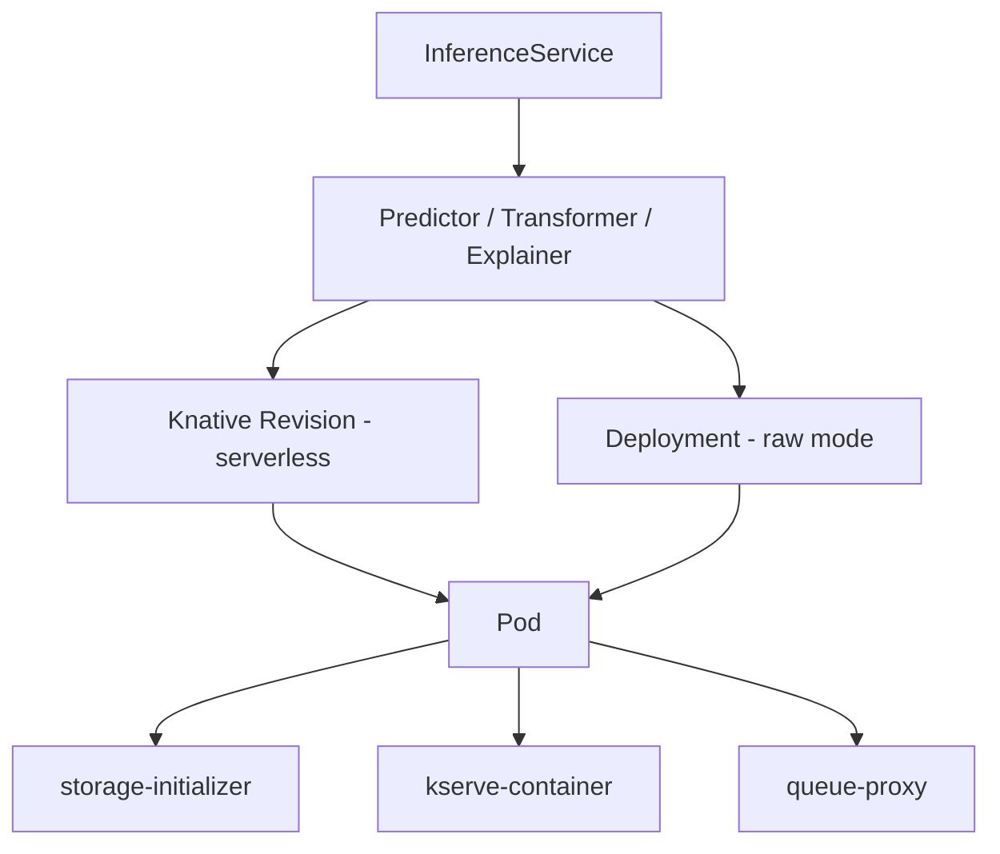

# KServe Debugger

## RP Component
This skill handles the `kserve` component from ReportPortal launches.

## Resource Hierarchy

## Deployment Modes

| Mode | How It Works | Failure Signatures |
|---|---|---|
| Serverless (Knative) | Scale-to-zero, cold starts | `RevisionFailed`, `IngressNotConfigured`, route errors |
| RawDeployment | Standard K8s Deployment | Pod scheduling, resource limits |
| ModelMesh | Shared runtime pods | Model cache, runtime pod crashes |

## Known Failure Patterns

### Product Bugs
- `no matches for kind.*InferenceService` → KServe CRD not installed
- `failed to reconcile` → KServe controller reconciliation error
- `InferenceService.*not.*[Rr]eady` with generous timeout + healthy cluster → Component broken
- `RevisionFailed` → Container crash during startup
- `LatestCreatedRevisionNotReady` → Model failed to load

### Infrastructure Issues
- `IngressNotConfigured` → Knative/Istio misconfiguration
- `CrashLoopBackOff` → Container startup failure
- `Insufficient.*cpu|Insufficient.*memory` → Resource constraints

### Test Automation Issues
- Short timeout (< 120s) for ISVC readiness → Timeout too aggressive
- `AssertionError` on status check → Wrong expected state

## CR Status Checks

| Condition | Meaning |
|---|---|
| `Ready=False` | ISVC not serving — check sub-conditions |
| `PredictorReady=False` | Predictor pod not running — check events |
| `IngressReady=False` | Knative route or Istio ingress misconfigured |
| `LatestCreatedRevisionReady=False` | Container failed to start |

## Diagnosis Steps

1. Read test failure logs
2. Check if ISVC status conditions reveal the root cause
3. If cluster access available, run `scripts/inspect_kserve.sh`
4. Trace: ISVC → Predictor → Revision → Pod → Container logs
5. Determine if issue is in KServe controller, Knative, or model runtime
6. Classify and output structured JSON

## Timeout Expectations

| Operation | Expected Duration |
|---|---|
| ISVC ready | 2-10 min (depends on model size) |
| Cold start (serverless) | 30s-5 min |
| Model download | 1-10 min (depends on model size and S3 bandwidth) |
