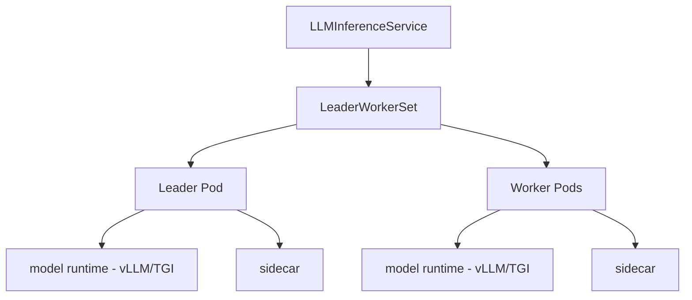

# LLMD Debugger

## RP Component
This skill handles the `llmd` component from ReportPortal launches.

## Resource Hierarchy

## Dependencies

- LeaderWorkerSet CRD (`leaderworkerset.x-k8s.io/v1`) — MUST be pre-installed
- KServe operator
- GPU nodes for each worker

## Known Failure Patterns

### Product Bugs (Critical)
- `no matches for kind.*LeaderWorkerSet` → LWS CRD not installed (CRITICAL dependency)
- `failed to build the expected main LWS` → LLMD reconciler cannot create worker sets
- `failed to reconcile multi-node main workload` → Orchestration failure
- `llminferenceservice.*failed` → LLMD controller error

### Infrastructure Issues
- `worker.*not.*ready|leader.*not.*ready` → Worker/leader pod scheduling or startup failure
- `GPU.*unavailable|Insufficient.*nvidia` → Not enough GPU nodes for workers
- `OOMKilled` on worker pods → Memory limit insufficient for model shard

### Test Automation Issues
- Short timeout for multi-node startup → Needs 10-20 min for large distributed models

## Diagnosis Steps

1. Read test failure logs
2. Check for LWS CRD existence: `no matches for kind.*LeaderWorkerSet` is immediate product bug
3. Check LLMInferenceService `.status.conditions` for reconciliation errors
4. If cluster access available, run `scripts/inspect_llmd.sh`
5. Check leader pod status, then worker pod statuses
6. Classify and output structured JSON

## Timeout Expectations

| Operation | Expected Duration |
|---|---|
| LWS creation | 1-3 minutes |
| Multi-node startup (all workers) | 10-20 minutes |
| Model sharding across nodes | 5-15 minutes |
