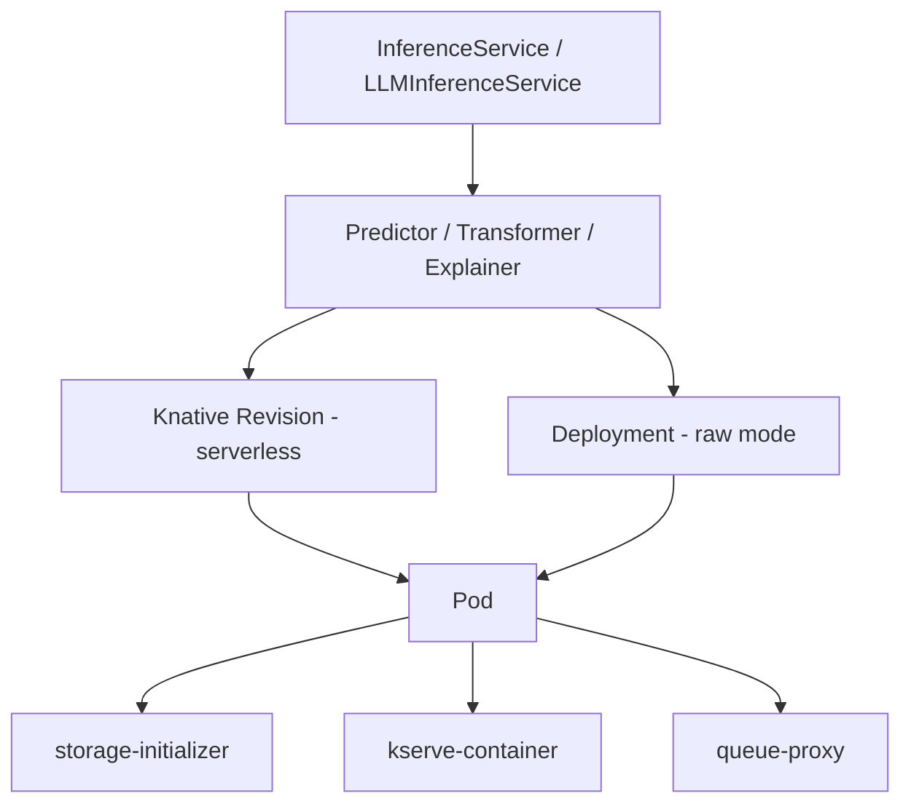

# Model Server Debugger

## RP Component
This skill handles the `Model_server` / `Model Server` component from ReportPortal launches.

## Sub-Orchestration

Model server failures often originate in the underlying serving infrastructure. When the
root cause is not in the model runtime itself, delegate to the appropriate sub-skill:

```
Model Server failure
    │
    ├── Is the failure in the model runtime (vLLM, TGI, Caikit)?
    │   └── YES → Diagnose here (model server domain)
    │
    ├── Is the failure in InferenceService lifecycle, Knative, or routing?
    │   └── YES → Invoke debugger-kserve diagnosis steps
    │
    ├── Is the failure in LLMInferenceService, LeaderWorkerSet, or multi-node?
    │   └── YES → Invoke debugger-llmd diagnosis steps
    │
    └── Is the failure in shared runtime pods, model loading, or gRPC?
        └── YES → Invoke debugger-modelmesh diagnosis steps
```

### When to sub-orchestrate

| Log Pattern | Delegate To | Why |
|---|---|---|
| `InferenceService.*not.*Ready`, `RevisionFailed`, `IngressNotConfigured`, `Knative` | **debugger-kserve** | ISVC lifecycle, Knative serving, routing |
| `no matches for kind.*InferenceService`, `kserve-controller`, `failed to reconcile` | **debugger-kserve** | KServe controller or CRD issue |
| `LeaderWorkerSet`, `LLMInferenceService`, `multi-node`, `worker.*not.*ready` | **debugger-llmd** | Distributed inference, LWS orchestration |
| `no matches for kind.*LeaderWorkerSet`, `llmd`, `failed to build.*LWS` | **debugger-llmd** | LLMD controller or LWS CRD missing |
| `modelmesh`, `model.*not.*loaded`, `ServingRuntime.*not.*found`, `gRPC.*UNAVAILABLE` | **debugger-modelmesh** | Shared runtime, model cache, gRPC |
| `OOMKilled` on `modelmesh-serving` pods, `CrashLoopBackOff` on runtime pods | **debugger-modelmesh** | ModelMesh runtime pod issue |

### How to sub-orchestrate

When delegating, read the target skill's SKILL.md and follow its diagnosis steps with the
same failure data. Combine findings into a single classification result. The root cause
may span multiple layers — e.g., a model server timeout caused by a kserve ISVC that
never became ready because of a missing LeaderWorkerSet CRD (llmd).

1. Read the relevant sub-skill's `SKILL.md` for domain knowledge and failure patterns
2. Run that sub-skill's inspect scripts if cluster access is available
3. Use the combined context to classify the failure accurately
4. Credit the actual layer where the root cause lives in the classification

## Directory Structure

```
debugger-model-server/
├── SKILL.md                       # This file — parent skill with sub-orchestration
├── scripts/
│   ├── inspect_serving.sh         # Model runtime pod inspection (vLLM, TGI, Caikit)
│   └── parse_serving_logs.py      # Extract model server log patterns
├── debugger-kserve/
│   ├── SKILL.md                   # KServe domain knowledge and diagnosis steps
│   └── scripts/
│       ├── inspect_kserve.sh      # ISVC status, Knative revisions, routes
│       └── parse_kserve_logs.py   # KServe log pattern extraction
├── debugger-llmd/
│   ├── SKILL.md                   # LLMD domain knowledge and diagnosis steps
│   └── scripts/
│       ├── inspect_llmd.sh        # LWS status, leader/worker pods
│       └── parse_llmd_logs.py     # LLMD log pattern extraction
└── debugger-modelmesh/
    ├── SKILL.md                   # ModelMesh domain knowledge and diagnosis steps
    └── scripts/
        ├── inspect_modelmesh.sh   # Runtime pods, model cache, gRPC status
        └── parse_modelmesh_logs.py # ModelMesh log pattern extraction
```

## Resource Hierarchy



## Serving Stack Layers

```
┌──────────────────────────────────────────────┐
│              Model Server Tests              │  ← Test failures land here
├──────────────────────────────────────────────┤
│  Model Runtime (vLLM, TGI, Caikit)          │  ← debugger-model-server
├──────────────────────────────────────────────┤
│  KServe (ISVC, Knative, routing)            │  ← debugger-kserve
│  LLMD (LLMInferenceService, LWS, workers)   │  ← debugger-llmd
│  ModelMesh (shared runtimes, gRPC, cache)   │  ← debugger-modelmesh
├──────────────────────────────────────────────┤
│  Kubernetes (pods, services, networking)     │  ← cluster health
└──────────────────────────────────────────────┘
```

## Known Failure Patterns

### Infrastructure Issues
- `storage-initializer.*exit.*code|InvalidAccessKeyId|AccessDenied.*S3` → S3 credentials or bucket access
- `OOMKilled|Out.*Of.*Memory` → Model too large for container memory limit
- `nvidia.com/gpu.*Insufficient|no.*GPU.*available` → GPU resources unavailable
- `ImagePullBackOff|ErrImagePull` → Container image unavailable or registry auth failed
- `huggingface.*401|HF_ACCESS_TOKEN|gated.*repo` → HuggingFace token missing for gated model

### Product Bugs
- `InferenceService.*not.*[Rr]eady` → ISVC failed to become ready → **check kserve layer**
- `RevisionFailed|LatestCreatedRevision.*not.*ready` → Model container crashed → **check kserve layer**
- `500.*Internal.*Server.*Error` → Backend service failure
- `inference.*failed|prediction.*error` → Model inference returned error
- `LeaderWorkerSet.*not.*found` → LWS CRD missing → **check llmd layer**
- `model.*not.*loaded|gRPC.*UNAVAILABLE` → ModelMesh issue → **check modelmesh layer**

### Test Automation Issues
- `TimeoutExpiredError` with timeout < 300s → Test wait time too short for model load
- `AssertionError` → Wrong expected value (check which)

## Timeout Expectations

| Operation | Expected Duration |
|---|---|
| Model load (LLMs) | 5-15 minutes |
| Model load (small) | 1-2 minutes |
| Inference request | 30s most, 2-5 min large LLMs |
| Pod ready | 2-5 minutes |
| Cold start (serverless) | 30s-5 min |
| Multi-node startup (LLMD) | 10-20 minutes |

## Diagnosis Steps

1. Read the test failure logs (provided by orchestrator)
2. **Determine which layer the failure is in:**
   - Model runtime errors (vLLM/TGI/Caikit crashes, inference errors) → diagnose here
   - ISVC lifecycle / Knative / routing errors → read `debugger-kserve` SKILL.md and follow its steps
   - LLMInferenceService / LeaderWorkerSet / multi-node errors → read `debugger-llmd` SKILL.md and follow its steps
   - Shared runtime / model loading / gRPC errors → read `debugger-modelmesh` SKILL.md and follow its steps
3. If cluster access available, run the appropriate inspect script(s):
   - `scripts/inspect_serving.sh` — model runtime pods
   - `debugger-kserve/scripts/inspect_kserve.sh` — ISVC status, revisions
   - `debugger-llmd/scripts/inspect_llmd.sh` — LWS, leader/worker pods
   - `debugger-modelmesh/scripts/inspect_modelmesh.sh` — runtime pods, model cache
4. Load architecture context for the relevant component(s)
5. Classify the failure — credit the actual layer where the root cause lives
6. Output structured JSON result

## Output Format

```json
{
  "test_id": "<id>",
  "test_name": "<name>",
  "classification": "product_bug|infrastructure_issue|automation_bug|intermittent|to_investigate",
  "severity": "critical|high|medium|low",
  "confidence": 0.0-1.0,
  "root_cause": "<description>",
  "root_cause_layer": "model_runtime|kserve|llmd|modelmesh|infrastructure",
  "recommendation": "<action>",
  "rp_defect_type": "pb001|si001|ab001|ab_1kbn5su3gqpdt|ti001"
}
```
